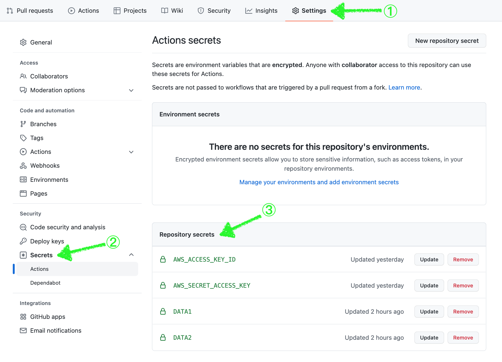

# Prerequisite tools

- AWS Account
- AWS Cli
- Packer
- Terraform

## Query based AMI

```bash
    aws ec2 describe-images --owner $(aws ssm get-parameters \
    --names /aws/service/canonical/meta/publisher-id \
    --query 'Parameters[0].[Value]' \
    --output text)
```

## Build your AMI (takes 10-13 mins)

```bash
    cd packer
    packer build vm.pkr.hcl
```

## Setting up GitHub Actions 🧨🧨🧨

```Fork the repo and clone```

```Set Secrets for GHAs```



```md
    a. AWS_ACCESS_KEY_ID = YOUR_AWS_ACCESS_KEY
    b. AWS_SECRET_ACCESS_KEY = YOUR_AWS_SECRET_ACCESS_KEY
    c. DATA1 = YOUR_TFVARS_BASE64_ENCODED_VALUES
    base64 terraform.tfvars
    d. DATA2 = YOUR_BACKEND_CONFIF_BASE64_ENCODED_VALUES
    base64 backend.conf
```

```Run your GHAs 🚀🚀🚀```


